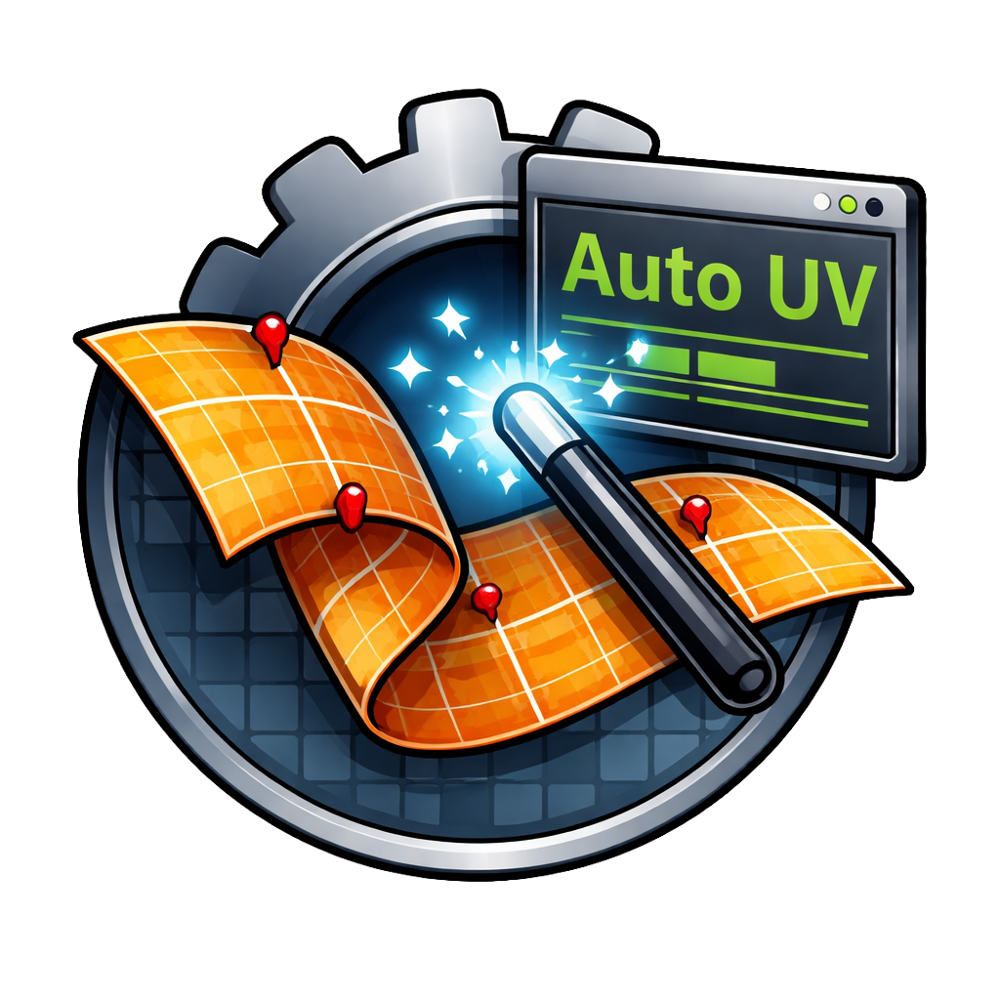

# Ministry of Flat Bridge

<p align="center">
  
</p>

A **Blender addon** that bridges [Ministry of Flat](https://www.quelsolaar.com) — the automatic UV unwrapper by **Eskil Steenberg** — directly into Blender's workflow.

---

## Disclaimer — Binaries Not Included

> **This addon does not distribute the Ministry of Flat executable files.**
>
> The original `UnWrapConsole3.exe` and `UnWrap3.exe` binaries are the work and property of **Eskil Steenberg** ([quelsolaar.com](https://www.quelsolaar.com)).
>
> You can obtain them in one of two ways:
> - **Automatic download** — use the *Download Ministry of Flat* button inside Blender (Addon Preferences or the MoF Bridge N-panel). The addon will download and extract the official release for you.
> - **Manual download** — grab the zip directly from [quelsolaar.com/MinistryOfFlat_Release.zip](https://www.quelsolaar.com/MinistryOfFlat_Release.zip) and extract it into the `mof_ble_bridge/MinistryOfFlat_Release/` folder next to this addon.

---

## Features

- **One-click UV unwrap** for all selected mesh objects.
- **Full CLI control** — every Ministry of Flat parameter exposed in a clean grouped dialog:
  - Basic (resolution, aspect, UDIMs, separate hard edges, normals)
  - Overlap & Mirroring
  - World Scale UVs with texture density
  - Geometry analysis (quads, cones, grids, strips, patches, planes, …)
  - Unfolding (merge, pre-smooth, soft unfold, ABF, tubes, …)
  - Post-processing (repair, relax, stretch, match, expand, …)
  - Packing (rasterization resolution, iterations, scale-to-fit)
  - Seam direction centre point
  - Debug flags (silent, suppress, validate)
- **Auto-download button** — fetches the official release zip and extracts it in place.
- **UV transfer** — UVs are written back to the original object; no stray imports left in the scene.
- **Multiple object support** — select many meshes and unwrap them all in one go.
- **N-panel** in the 3D Viewport (`N` → *MoF Bridge* tab).
- **UV Editor side panel** (*MoF Bridge* tab).
- Addon icon shown in panels and menus.

---

## Installation

### Install from zip (recommended)

1. Download the latest release zip from the [Releases](../../releases) page.
2. In Blender → *Edit → Preferences → Add-ons → Install* — select the zip.
3. Enable **Ministry of Flat Bridge**.
4. Open Preferences for the addon and either:
   - Click **Download Ministry of Flat** to auto-fetch the binaries, or
   - Point the *Ministry of Flat Folder* path to an existing installation.

### Development install (Windows)

```bat
python .scripts/hardlink_addon_to_blenders.py
```

This creates an NTFS junction from `mof_ble_bridge/` into every detected Blender version's addons folder so edits are reflected instantly.

---

## Usage

1. Select one or more mesh objects.
2. Press `N` in the 3D Viewport → *MoF Bridge* tab → **Auto UV Unwrap**.
3. Adjust parameters in the dialog and click **OK**.
4. New UVs are applied directly to the selected objects.

The operator is also accessible from the **Object menu** in the 3D Viewport header.

---

## Credits

| | |
|---|---|
| **Ministry of Flat** | Eskil Steenberg — [quelsolaar.com](https://www.quelsolaar.com) |
| **Blender Bridge** | Michal Hons — [mehpixel.com](https://www.mehpixel.com) |

---

## License

The Blender addon code in this repository is released under the **MIT License**.
Ministry of Flat itself is © Eskil Steenberg — see [quelsolaar.com](https://www.quelsolaar.com) for its licensing terms.
